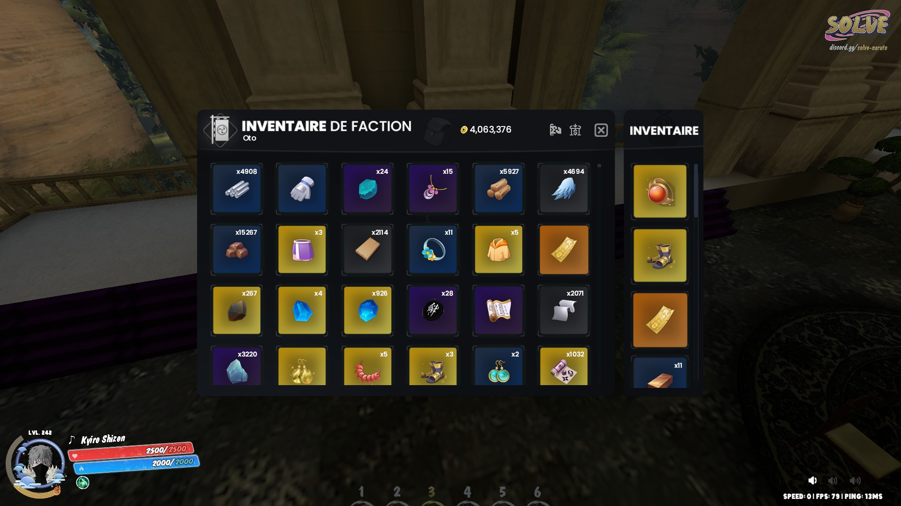
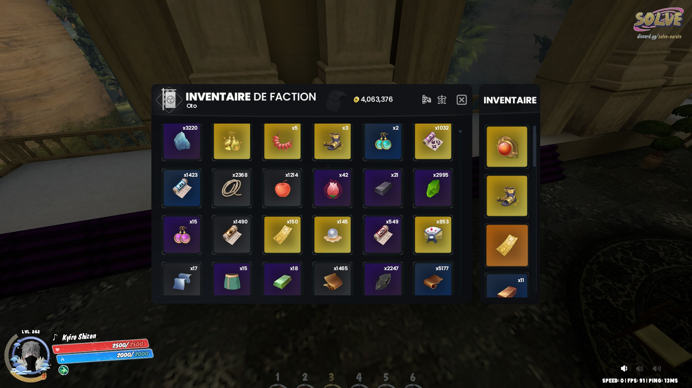
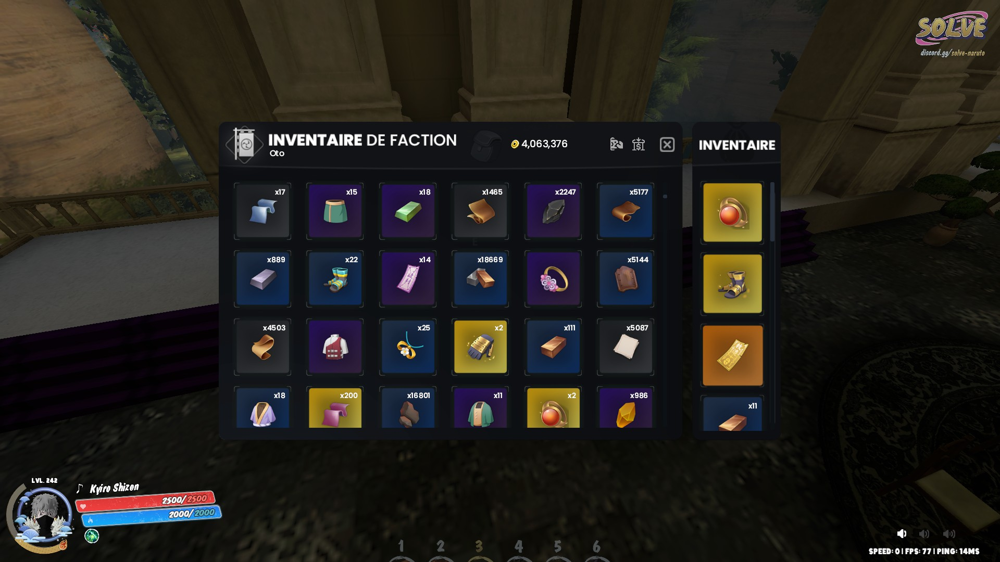
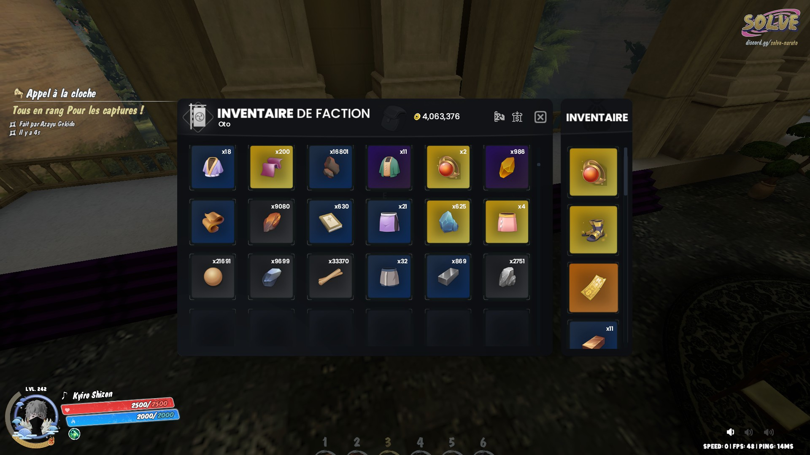

# Chest-Reco

Programme permettant d'estimer les stocks à partir d'images d'un coffre dans 
le jeu vidéo _Garry's Mod_, en utilisant l'extraction de motifs et la 
reconnaissance optique de caractères (OCR) pour lire les quantités.

## Exemple d'image

### Remarques sur la capture

Le coffre doit être capturé en plusieurs prises successives pour couvrir l'ensemble des emplacements. Veillez à :
- recouvrir légèrement les zones entre captures,

_Exemple :_





Les captures du coffre doivent être effectuées directement via Steam, afin d'éviter tout problème lié aux dimensions des images.

## Installation et utilisation

Prérequis :
- Git
- Python 3.8+ (ou version compatible)
- Pip

1. Cloner le dépôt
```
git clone https://github.com/titusse3/chest-reco.git
cd chest-reco
```

2. Créer et activer un environnement virtuel
- macOS / Linux
```
python -m venv env
source env/bin/activate
```
- Windows (PowerShell)
```
python -m venv env
.\env\Scripts\Activate.ps1
```

3. Installer les dépendances
```
pip install -r requirements.txt
```

4. Lancer le programme
(Exécuter depuis la racine du projet)
```
python main.py <chemin-vers-le-dossier>
```